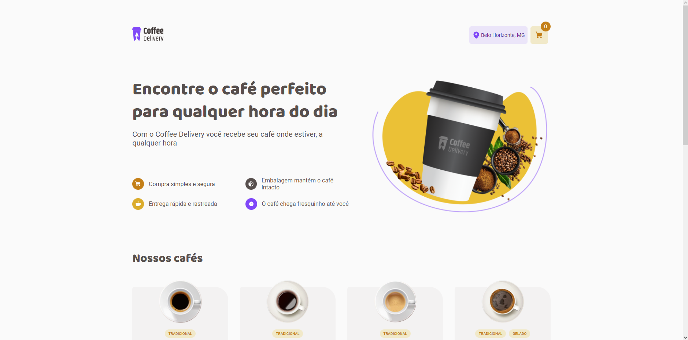
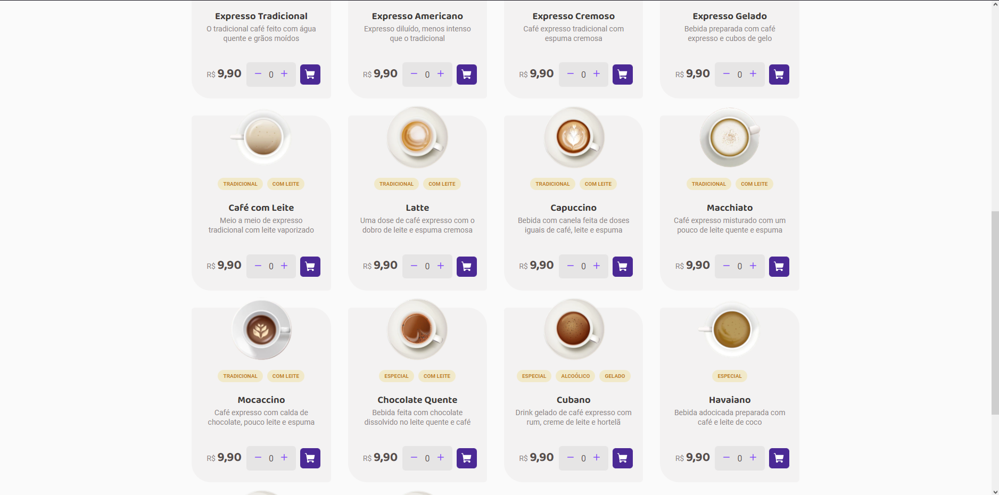

# Coffee Delivery Project

Este é um projeto com objetivo de implementar alguns conhecimentos em ReactJS a partir de um design fornecido pela rocketseat no [Figma](https://www.figma.com/file/gWUwP41Xo4vU6GpzuwHeS7/Coffee-Delivery-•-Desafio-React-(Copy)?type=design&node-id=2-12&mode=design&t=hnm2ByTy3anIsAWZ-0).

### Sobre a aplicação
Nela deve ser permitido: 

- Listagem de produtos (cafés) disponíveis para compra
- Adicionar uma quantidade específicas de itens no carrinho
- Aumentar ou remover a quantidade de itens no carrinho
- Formulário para o usuário preencher o seu endereço
- Exibir o total de itens no carrinho no Header
- Exibir o valor total da soma de itens no carrinho multiplicados pelo valor

Conceitos abordados para construção da aplicação

- Estados
- ContextAPI
- LocalStorage
- Imutabilidade do estado
- Listas e chaves no ReactJS
- Propriedades
- Componentização

Para um bom desafio será necessário estudar sobre reduce em arrays.

